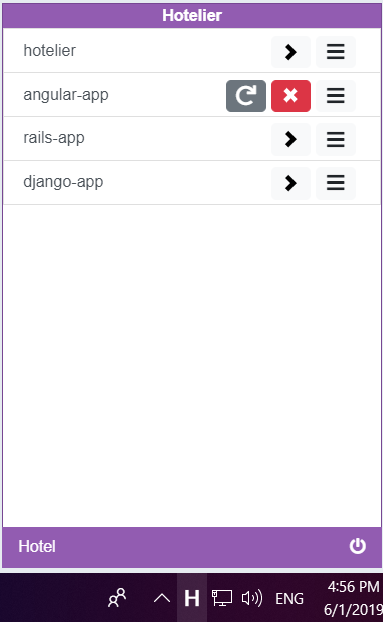
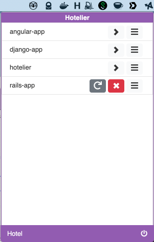
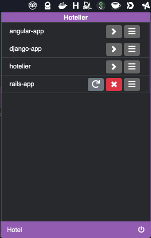
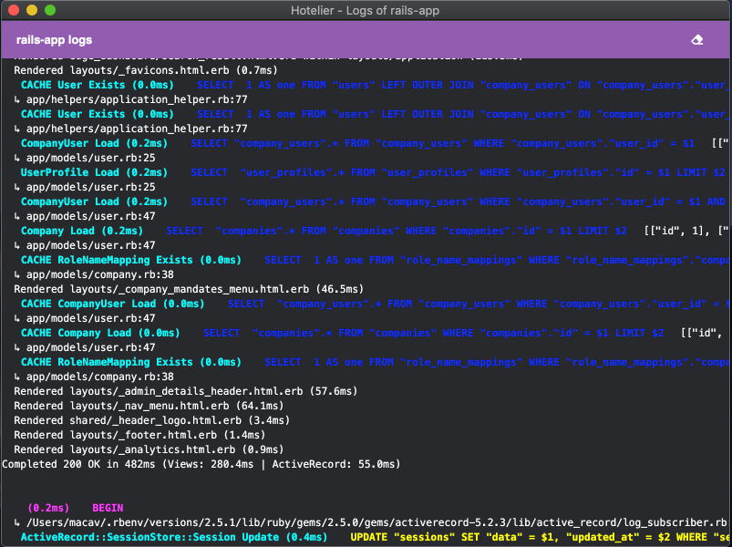

# Hotelier

Tray App for [Hotel](https://github.com/typicode/hotel) process manager which works on Windows, Mac and (potentially) Linux.

## Install

Download the [latest release](https://www.github.com/macav/hotelier/releases) and install it.

Alternately, install with [Homebrew](https://brew.sh) on macOS:

```shellsession
$ brew tap macav/hotelier https://www.github.com/macav/hotelier.git
$ brew cask install hotelier
```

## About







### Description

The main purpose of the app is allowing easy management of the servers directly from the tray / menu bar, without the need of opening the `Hotel` in the browser, or using the CLI.

The app works currently in a happy path scenario, meaning for example it doesn't handle situation where you don't have `Hotel` installed.

It is created using React & Electron, making it easy to extend. The downside is the app size (~ 150 MB), but that's the price to pay for the maintainability.

### Motivation

I decided to create the app because all other alternatives didn't work properly for me, or where too outdated and not maintained anymore (2018).

### Builds

The builds are available for Mac (`.dmg`) and Windows (32 & 64 bit).

## Features

Currently, the following features are implemented:

- See all your servers with status
- Start / stop servers
- Open the server URL by clicking on the server
- Browse logs
- Handles Hotel configuration (host, port, TLD)
- Dark mode

In the future, I plan to add at least:

- Handling of edge cases (e.g. Hotel not installed)
- Custom config (per-server - such as opening URL, or global - theme)

## Contribution

- `git clone git@github.com:macav/hotelier.git`
- `cd hotelier`
- `yarn`
- `yarn start`

PRs are very welcome!

## Licence

**MIT** - Martin Cavoj
